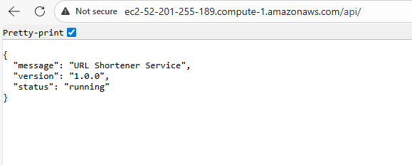
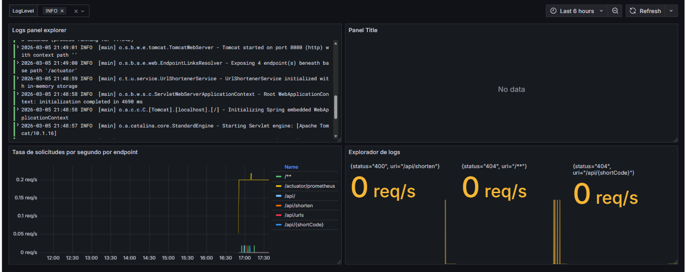
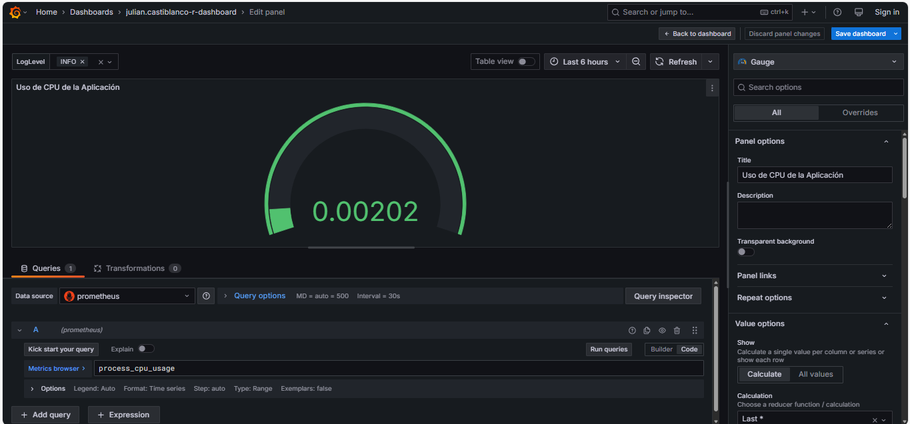
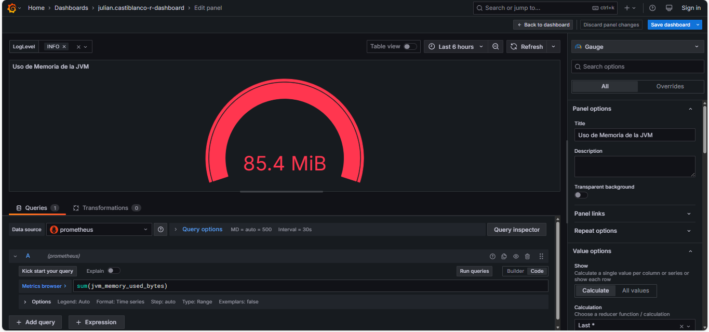

# Bitácora Experimento - Observabilidad y Monitoreo

**Nombre del estudiante:** Julian David Castiblanco Real  
---

Cuando acabes no olvides ayudarnos evaluando tu ⭐[experiencia](https://forms.office.com/r/US1LARPmec)⭐

## Tabla de Contenidos
- [Etapa 1: Preparación del Ambiente](#etapa-1-preparación-del-ambiente)
- [Etapa 2: Métricas Iniciales](#etapa-2-métricas-iniciales)
- [Etapa 2.1: Dashboard Base en Grafana](#etapa-21-dashboard-base-en-grafana)
- [Etapa 2.2: Propuesta de Métrica Personalizada](#etapa-22-propuesta-de-métrica-personalizada)
- [Etapa 3: Experimentación y Análisis del Sistema](#etapa-3-experimentación-y-análisis-del-sistema)

---

## Etapa 1: Preparación del Ambiente

### 1.1. Información de la instancia EC2

### 1.2. Verificación del despliegue

**¿La aplicación se desplegó correctamente?** 

- [X] Sí
- [ ] No

**Captura de pantalla de la aplicación funcionando:**

> 

**Dns Publico**
> ec2-52-201-255-189.compute-1.amazonaws.com

### 1.3. Observaciones y problemas encontrados (opcional)
```
```

---

## Etapa 2: Métricas Iniciales

### 2.0.1. Generación de tráfico

**Endpoints probados:**

- [X] `GET /api/`
- [X] `POST /api/shorten`
- [X] `GET /api/{shortCode}`
- [X] `GET /api/urls`


### 2.0.2. Análisis de dos métricas relevantes

#### Métrica 1

**Nombre de la métrica:**  
```
http_server_requests_seconds_max

```

**Tipo de métrica:** 
- [ ] Counter
- [X] Gauge 
- [ ] Histogram 
- [ ] Summary

**Descripción de qué información aporta:**
```
Esta métrica indica el tiempo máximo de duración (en segundos) registrado para las
peticiones HTTP del servidor dentro de la ventana de recolección de métricas.

Permite identificar cuál fue la petición más lenta para un endpoint específico
durante el intervalo de observación.

```

**Relación con otras métricas (si aplica):**
```
Se relaciona directamente con:

- http_server_requests_seconds_count → número total de peticiones.
- http_server_requests_seconds_sum → suma total del tiempo de todas las peticiones.

Estas métricas juntas permiten calcular tiempos promedio, analizar latencias
y detectar endpoints con rendimiento deficiente.

También puede relacionarse con métricas de infraestructura como:
- uso de CPU
- memoria JVM
- número de threads

```

**¿En que escenarios puede ayudar esta métrica?**
```

- Detectar endpoints lentos dentro de la aplicación.
- Identificar picos de latencia en ciertas rutas.
- Analizar problemas de rendimiento en APIs.
- Monitorear degradación del servicio cuando aumenta la carga.
- Identificar operaciones que tardan demasiado (por ejemplo consultas a base de datos).

```

**¿Qué etiquetas (labels) se utilizan para agrupar los datos?**
```
error
exception
method
outcome
status
uri

```

---

#### Métrica 2

**Nombre de la métrica:**  
```
http_server_requests_seconds
```

**Tipo de métrica:** 
- [ ] Counter
- [ ] Gauge 
- [ ] Histogram 
- [X] Summary

**Descripción de qué información aporta:**
```
Esta métrica mide el tiempo de duración de las peticiones HTTP que recibe el servidor,
expresado en segundos.

El tipo Summary proporciona información agregada sobre las peticiones, incluyendo:

- http_server_requests_seconds_count → número total de peticiones realizadas
- http_server_requests_seconds_sum → suma total del tiempo que tardaron todas las peticiones

Con estos valores se puede calcular el tiempo promedio de respuesta de las
peticiones HTTP del sistema.

```

**Relación con otras métricas (si aplica):**
```
Se relaciona con:

- http_server_requests_seconds_max → muestra la duración máxima de una petición
- métricas de JVM (memoria, garbage collector)
- métricas de CPU o uso de hilos

Por ejemplo, si el tiempo total o el promedio de las peticiones aumenta,
puede deberse a alto uso de CPU, consultas lentas a base de datos o alta carga
de solicitudes HTTP.

```

**¿En que escenarios puede ayudar esta métrica?**
```

- Analizar el rendimiento general de la API.
- Calcular el tiempo promedio de respuesta de los endpoints.
- Detectar endpoints con mayor carga de solicitudes.
- Identificar problemas de latencia en el servidor.
- Evaluar el comportamiento del sistema bajo alta demanda.

```

**¿Qué etiquetas (labels) se utilizan para agrupar los datos?**
```
error
exception
method
outcome
status
uri


```

---

## Etapa 2.1: Dashboard Base en Grafana


### 2.1.1. Evidencia: Dashboard Base en Grafana con los 4 paneles iniciales

**Captura de pantalla del dashboard:**

> _[Inserta aquí la imagen del dashboard con los 4 paneles]_

### 2.1.2. Visualizaciónes Adicionales (Con las metricas actuales)

#### Visualización Adicional 1

**Propósito:**
```
¿Qué quieres analizar o mostrar? Menciona qué métrica(s) vas a usar
Monitorear el porcentaje de CPU utilizado por la aplicación Java. Este panel permite detectar momentos en los que el sistema está consumiendo muchos recursos de procesamiento, lo que podría afectar el rendimiento o causar aumento en la latencia de las solicitudes.

```

**Título del panel:**
```
Uso de CPU de la aplicación
```

**Consulta (PromQL o LogQL):**
```
process_cpu_usage
```

**Tipo de visualización:** 
- [ ] Time series
- [X] Gauge
- [ ] Bar chart
- [ ] Stat
- [ ] Logs
- [ ] Otro: _____

**Otros ajustes aplicados (colores, unidades, etc.) (opcional):**
```
No

```

**Captura de pantalla:**

> 

**Análisis (2-3 frases):**
```
¿Qué conclusiones o patrones observas?
Este panel permite observar el consumo de CPU de la aplicación. 
Un uso moderado indica que el sistema está funcionando de manera 
eficiente. Sin embargo, si el valor se mantiene cercano al máximo 
durante periodos prolongados, podría indicar que la aplicación está
bajo una carga alta o que existen procesos que consumen demasiados 
recursos.

```

---

#### Visualización Adicional 2

**Propósito:**
```
¿Qué quieres analizar o mostrar? Menciona qué métrica(s) vas a mostrar
Visualizar la cantidad de memoria utilizada por la JVM, lo cual es fundamental para detectar posibles problemas de memoria, como consumo excesivo o riesgo de OutOfMemoryError.

```

**Título del panel:**
```
Memoria utilizada por la JVM
```

**Consulta (PromQL o LogQL):**
```
sum(jvm_memory_used_bytes)
```

**Tipo de visualización:** 
- [ ] Time series
- [X] Gauge
- [ ] Bar chart
- [ ] Stat
- [ ] Logs
- [ ] Otro: _____

**Otros ajustes aplicados (colores, unidades, etc.) (opcional):**
```
No

```

**Captura de pantalla:**

> 

**Análisis (2-3 frases):**
```
¿Qué conclusiones o patrones observas?
Este panel muestra el consumo total de memoria de la JVM. 
Un aumento progresivo en el uso de memoria puede ser normal si 
la aplicación está manejando más solicitudes. Sin embargo, 
si la memoria sigue creciendo sin disminuir, podría indicar un 
posible memory leak o una mala gestión de recursos.


```

---

### 2.1.3. Análisis final del dashboard

**¿Qué otros datos te gustaría visualizar si tuvieras más información disponible?**
```
Si tuviera más información disponible, me gustaría visualizar 
métricas relacionadas con el uso de recursos del sistema, 
como CPU, memoria y almacenamiento, para identificar si la 
infraestructura está siendo utilizada de manera eficiente o 
si existe riesgo de saturación. También sería útil monitorear 
métricas de la base de datos, como el tiempo de respuesta de las 
consultas y el número de conexiones activas, para detectar posibles 
cuellos de botella en el acceso a datos. Además, observar el número
de usuarios activos o sesiones concurrentes permitiría relacionar 
el rendimiento de la aplicación con el nivel real de uso. 
Finalmente, métricas de tráfico y latencia de red ayudarían a 
identificar problemas en la comunicación entre servicios o 
componentes del sistema.

```

---

## Etapa 2.2: Propuesta de Métrica Personalizada


### 2.2.1. Análisis y propuesta de la métrica propia (en Java)

**1. Nombre de la métrica:**
```
application_cpu_usage
```

**2. Tipo de métrica:**
- [ ] Counter
- [X] Gauge

**3. ¿Qué comportamiento mide?**
```
Mide el porcentaje de uso de CPU que está consumiendo la aplicación en el
momento de la medición. Este valor refleja la carga actual del proceso
de la aplicación dentro del sistema donde se está ejecutando.


```

**4. ¿Por qué es relevante para el sistema?**
```

Esta métrica permite monitorear el consumo de recursos de la aplicación,
lo cual es fundamental para detectar situaciones de alta carga o posibles
problemas de rendimiento. También ayuda a identificar cuándo la aplicación
podría necesitar más recursos o escalamiento para mantener un buen
desempeño bajo alta demanda.

```

---


### 2.2.3. Visualización en Grafana

**1. ¿Qué tipo de panel usaste en Grafana?**

- [ ] Time series  
- [ ] Gauge  
- [ ] Stat  
- [ ] Bar chart  
- [ ] Otro: _____

**2. ¿Qué consulta PromQL vas a utilizar?**
```promql


```

**3. ¿Cuál es el propósito de la visualización?**
```
Provee una interpretación en palabras con el propósito de la visualización. Que te interesa ver en el panel?


```


---

### 2.2.4. Panel creado en Grafana

**Captura de pantalla del panel en Grafana:**

> _[Inserta aquí la imagen del panel mostrando la métrica visualizada]_

---

## Etapa 3: Experimentación y Análisis del Sistema

### 3.1. Detección de anomalías y puntos de interés

**1. Como describirias la anomalía?**

```


```

**2. Que paneles te ayudaron a identificarlo?**

``` 


```

**3. Cual podria ser la causa de la anomalía?**

``` 


```

**Captura de pantalla del dashboard mostrando la anomalía:**

> _[Inserta aquí la imagen]_

---

### 3.2. Intento de corrección de anomalías


#### 3.2.1. Modificación del código

**Descripción del ajuste realizado:**
```
Describe en pocas palabras el ajuste realizado.


```

#### 3.2.2. Resultados después del despliegue

**¿El ajuste surtió efecto?**
- [ ] Sí 
- [ ] No 
- [ ] Parcialmente


**Captura de pantalla del dashboard después del ajuste:**

> _[Inserta aquí la imagen del estado del dashboard posterior al ajuste]_

---

### 5.7. Reflexión final

**¿Qué panel te resultó más útil para detectar problemas?**
```


```

**¿Qué métrica aporta mayor valor para monitorear un sistema real?**
```


```

**¿Qué agregarías o mejorarías en tu dashboard?**
```


```

**Fin de la bitácora**
